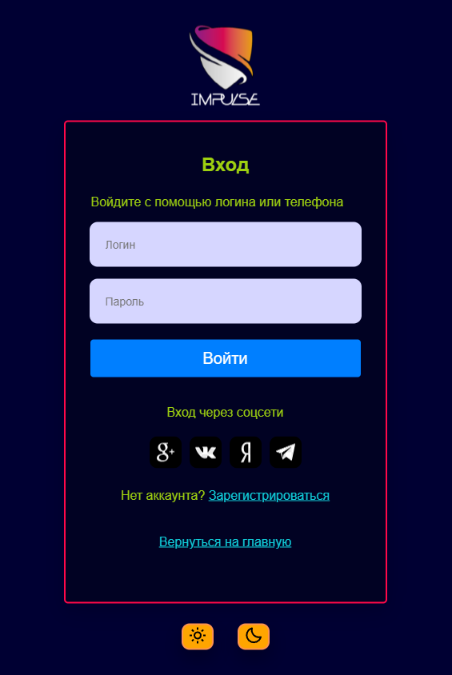

<h1 align="center">Login-Register-LMS</h1>

<h3 align="center">Task descripton</h3>

Нашей командой была выбрана задача №1: Формы логина и регистрации.

Метод /api/register: На вход принимает username, password, mail, phone, name, surname. Поля mail и phone опциональны. Производится проверка данных - если пользователь с таким mail уже существует - возвращать ошибку 200 "mail_not_available". После успешной регистрации создаются ресурсы UsersLogin, userData. В ресурс UsersLogin записываются username, password, mail. В ресурс userData записывается FirstName, LastName.

Метод /api/login: На вход принимается username, password, grant_type (для авторизации по паролю стоит password). В результате успешной авторизации пользователю будут отправляться два токена: access_token – токен авторизации, используемый для входа и refresh_token – используемый для обновления токена авторизации. Оба токена записываются в локальное хранилище и хранятся там.

<h3 align="center">Features</h3>
<ul>
  <li>Дизайнерские решения (наличие переключения тем, цветовое оформление)</li>
  <li>Хэширование (+соль) паролей</li>
</ul>

<h3 align="center">Tools</h3>

Для работы проекта необходимо:

<ul>
  <li>Node.js (v16.18.0)</li>
  <li>PostgreSQL (v15.0)</li>
  <li>Python 3 (v3.10.8)</li>
</ul>

<h3 align="center">How to start the project</h3>

<h4 align="center">Front-end</h4>
<ul>
  <li> $>: cd ./Login-Register-LMS/frontend</li>
  <li> $>: npm install react-router-dom, axios, format, boxicons</li>
  <li> Все зависимости можно найти в файле package.json в разделе "dependencies"</li>
  <li> $>: npm start</li>
</ul>

<h4 align="center">Back-end</h4>
<ul>
  <li> $>: cd ./Login-Register-LMS/backend</li>
  <li> $>: pip install pipenv - основная библиотка для виртуального окружения</li>
  <li> $>: pipenv shell - создание окружения, должен в конце появиться <ПУТЬ> к созданному окружению</li>
  <li> $>: C:\Users\Username\.virtualenvs\Login-Register-LMS-df9fd99v\Scripts\activate> - активация виртуального окружения</li>
  <li> (virtual-env) $>: pipenv install flask flask-sqlalchemy psycopg2 python-dotenv flask-cors - загрузка библиотек в окружение</li>
</ul>

<h3 align="center">Preview</h3>

